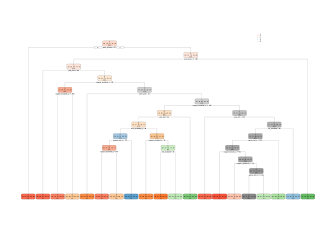

##Executive Summary
The goal of this project will be to use data from accelerometers on the belt, forearm, arm, and dumbell of 6 participants to predict how well study participants performed certain exercises in a test set of measurements. We fit three models (decision tree, random forest, and boosting) to the training data and determined the random forest method has the highest accuracy (99%).

"Classe" predictions from testing data:
`B A B A A E D B A A B C B A E E A B B B`

##Data
The data for this project come from this source: http://groupware.les.inf.puc-rio.br/har

Six participants were asked to perform were asked to perform barbell lifts correctly and incorrectly in 5 different ways:

* Class A: exactly according to the specification 

* Class B: throw- ing the elbows to the front

* Class C: lifting the dumbbell only halfway 

* Class D: lowering the dumbbell only halfway

* Class E: throwing the hips to the front

while monitored using Euler angles (roll, pitch and yaw), raw accelerometer, gyroscope and magnetometer readings.

##Data Processing
Download and tidy training/testing data.  Narrow down features.


```r
library(data.table); library(caret); library (kernlab); library(AppliedPredictiveModeling); library(dplyr); library(rpart); library(randomForest)
```

```
## Loading required package: lattice
```

```
## Loading required package: ggplot2
```

```
## 
## Attaching package: 'kernlab'
```

```
## The following object is masked from 'package:ggplot2':
## 
##     alpha
```

```
## 
## Attaching package: 'dplyr'
```

```
## The following objects are masked from 'package:data.table':
## 
##     between, first, last
```

```
## The following objects are masked from 'package:stats':
## 
##     filter, lag
```

```
## The following objects are masked from 'package:base':
## 
##     intersect, setdiff, setequal, union
```

```
## randomForest 4.6-14
```

```
## Type rfNews() to see new features/changes/bug fixes.
```

```
## 
## Attaching package: 'randomForest'
```

```
## The following object is masked from 'package:dplyr':
## 
##     combine
```

```
## The following object is masked from 'package:ggplot2':
## 
##     margin
```

```r
training <- read.csv(url("https://d396qusza40orc.cloudfront.net/predmachlearn/pml-training.csv"), na.strings = c("NA", "", "#DIV0!"))
testing <- read.csv(url("https://d396qusza40orc.cloudfront.net/predmachlearn/pml-testing.csv"), na.strings = c("NA", "", "#DIV0!"))

##Remove columns with NAs
training<-training[,colSums(is.na(training)) == 0]
testing <-testing[,colSums(is.na(testing)) == 0]

##Remove near zero variables
training <- select(training, -nearZeroVar(training))
testing <- select(testing, -nearZeroVar(testing))

##Remove irrelevant predictors (e.g. timestamp, index, name)
training <- training[,-c(1:7)]
testing <- testing[,-c(1:7)]
```


```r
names(training)
```

```
##  [1] "pitch_belt"           "yaw_belt"             "total_accel_belt"    
##  [4] "gyros_belt_x"         "gyros_belt_y"         "gyros_belt_z"        
##  [7] "accel_belt_x"         "accel_belt_y"         "accel_belt_z"        
## [10] "magnet_belt_x"        "magnet_belt_y"        "magnet_belt_z"       
## [13] "roll_arm"             "pitch_arm"            "yaw_arm"             
## [16] "total_accel_arm"      "gyros_arm_x"          "gyros_arm_y"         
## [19] "gyros_arm_z"          "accel_arm_x"          "accel_arm_y"         
## [22] "accel_arm_z"          "magnet_arm_x"         "magnet_arm_y"        
## [25] "magnet_arm_z"         "roll_dumbbell"        "pitch_dumbbell"      
## [28] "yaw_dumbbell"         "total_accel_dumbbell" "gyros_dumbbell_x"    
## [31] "gyros_dumbbell_y"     "gyros_dumbbell_z"     "accel_dumbbell_x"    
## [34] "accel_dumbbell_y"     "accel_dumbbell_z"     "magnet_dumbbell_x"   
## [37] "magnet_dumbbell_y"    "magnet_dumbbell_z"    "roll_forearm"        
## [40] "pitch_forearm"        "yaw_forearm"          "total_accel_forearm" 
## [43] "gyros_forearm_x"      "gyros_forearm_y"      "gyros_forearm_z"     
## [46] "accel_forearm_x"      "accel_forearm_y"      "accel_forearm_z"     
## [49] "magnet_forearm_x"     "magnet_forearm_y"     "magnet_forearm_z"    
## [52] "classe"
```

##Partition training data into training and test sets for cross-validation

```r
set.seed(2018)
inTrain <- createDataPartition(training$classe, p=3/4, list=FALSE)
training_train <- training[inTrain,]
training_test <- training[-inTrain,]
```

##Model 1: Decision Tree

```r
##Decision Tree
set.seed(2018)
model_rpart <- rpart(classe ~., data = training_train, method = "class")

pred_rpart <- predict(model_rpart, newdata= training_test, type="class")
confusionMatrix(pred_rpart, training_test$classe)
```

```
## Confusion Matrix and Statistics
## 
##           Reference
## Prediction    A    B    C    D    E
##          A 1209  152   24   28   31
##          B   25  504   57   70   22
##          C   52   83  577  159   90
##          D   90  145  173  446   85
##          E   19   65   24  101  673
## 
## Overall Statistics
##                                         
##                Accuracy : 0.6951        
##                  95% CI : (0.682, 0.708)
##     No Information Rate : 0.2845        
##     P-Value [Acc > NIR] : < 2.2e-16     
##                                         
##                   Kappa : 0.6145        
##  Mcnemar's Test P-Value : < 2.2e-16     
## 
## Statistics by Class:
## 
##                      Class: A Class: B Class: C Class: D Class: E
## Sensitivity            0.8667   0.5311   0.6749  0.55473   0.7469
## Specificity            0.9330   0.9560   0.9052  0.87976   0.9478
## Pos Pred Value         0.8373   0.7434   0.6004  0.47497   0.7630
## Neg Pred Value         0.9462   0.8947   0.9295  0.90971   0.9433
## Prevalence             0.2845   0.1935   0.1743  0.16395   0.1837
## Detection Rate         0.2465   0.1028   0.1177  0.09095   0.1372
## Detection Prevalence   0.2945   0.1383   0.1960  0.19148   0.1799
## Balanced Accuracy      0.8998   0.7435   0.7900  0.71724   0.8474
```

```r
#Plot Decision Tree
library(rpart.plot)
rpart.plot(model_rpart)
```

<!-- -->


##Model 2: Random Forest
Given the long run-times, I took a hint from the Coursera discussion forums to speed up the train function for rf - credit to https://github.com/lgreski/datasciencectacontent/blob/master/markdown/pml-randomForestPerformance.md

```r
##Random Forest
set.seed(2018)

    #Follow steps from "Improving Performance of Random Forest in caret::train()" cited above to improve rf run time
    #Step 1: Configure parallel processing
        library(parallel)
        library(doParallel)
```

```
## Loading required package: foreach
```

```
## Loading required package: iterators
```

```r
        cluster <- makeCluster(detectCores() - 1) # convention to leave 1 core for OS
        registerDoParallel(cluster)
    
    #Step 2: Configure trainControl object
        fitControl <- trainControl(method = "cv",number = 5,allowParallel = TRUE)
    
    #Step 3: Develop training model
        model_rf <- train(classe ~., data = training_train, method = "rf", prox=TRUE, trControl = fitControl)
    
    #Step 4: De-register parallel processing cluster
        stopCluster(cluster)
        registerDoSEQ()

#Run testing data through the model
pred_rf <- predict(model_rf, training_test)
confusionMatrix(training_test$classe, pred_rf)
```

```
## Confusion Matrix and Statistics
## 
##           Reference
## Prediction    A    B    C    D    E
##          A 1394    1    0    0    0
##          B    3  945    1    0    0
##          C    0   11  843    1    0
##          D    0    0   27  777    0
##          E    0    0    0    0  901
## 
## Overall Statistics
##                                          
##                Accuracy : 0.991          
##                  95% CI : (0.988, 0.9935)
##     No Information Rate : 0.2849         
##     P-Value [Acc > NIR] : < 2.2e-16      
##                                          
##                   Kappa : 0.9886         
##  Mcnemar's Test P-Value : NA             
## 
## Statistics by Class:
## 
##                      Class: A Class: B Class: C Class: D Class: E
## Sensitivity            0.9979   0.9875   0.9679   0.9987   1.0000
## Specificity            0.9997   0.9990   0.9970   0.9935   1.0000
## Pos Pred Value         0.9993   0.9958   0.9860   0.9664   1.0000
## Neg Pred Value         0.9991   0.9970   0.9931   0.9998   1.0000
## Prevalence             0.2849   0.1951   0.1776   0.1586   0.1837
## Detection Rate         0.2843   0.1927   0.1719   0.1584   0.1837
## Detection Prevalence   0.2845   0.1935   0.1743   0.1639   0.1837
## Balanced Accuracy      0.9988   0.9932   0.9824   0.9961   1.0000
```

##Model 3: Boosting

```r
#Boosting
set.seed(2018)
fitControl2 <- trainControl(method = "repeatedcv", number = 5, repeats = 1)
model_gbm <- train(classe ~ ., method="gbm", data=training_train,trControl=fitControl2, verbose=FALSE)

#Run testing data through the model    
pred_gbm <- predict(model_gbm, training_test)
confusionMatrix(training_test$classe, pred_gbm)
```

```
## Confusion Matrix and Statistics
## 
##           Reference
## Prediction    A    B    C    D    E
##          A 1369   16    5    4    1
##          B   29  904   10    2    4
##          C    0   29  815   10    1
##          D    0    1   25  770    8
##          E    2    7   21   13  858
## 
## Overall Statistics
##                                           
##                Accuracy : 0.9617          
##                  95% CI : (0.9559, 0.9669)
##     No Information Rate : 0.2855          
##     P-Value [Acc > NIR] : < 2.2e-16       
##                                           
##                   Kappa : 0.9515          
##  Mcnemar's Test P-Value : 3.592e-07       
## 
## Statistics by Class:
## 
##                      Class: A Class: B Class: C Class: D Class: E
## Sensitivity            0.9779   0.9446   0.9304   0.9637   0.9839
## Specificity            0.9926   0.9886   0.9901   0.9917   0.9893
## Pos Pred Value         0.9814   0.9526   0.9532   0.9577   0.9523
## Neg Pred Value         0.9912   0.9866   0.9849   0.9929   0.9965
## Prevalence             0.2855   0.1951   0.1786   0.1629   0.1778
## Detection Rate         0.2792   0.1843   0.1662   0.1570   0.1750
## Detection Prevalence   0.2845   0.1935   0.1743   0.1639   0.1837
## Balanced Accuracy      0.9852   0.9666   0.9602   0.9777   0.9866
```

##Conclusion
The random forest model produces the highest accuracy (99%) on our training test set, so we will use random forest to predict classe results from the testing data set.


```r
predict(model_rf, testing)
```

```
##  [1] B A B A A E D B A A B C B A E E A B B B
## Levels: A B C D E
```

